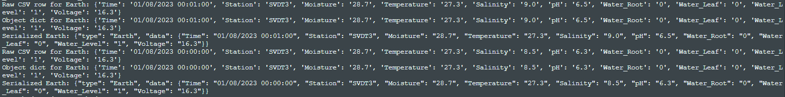
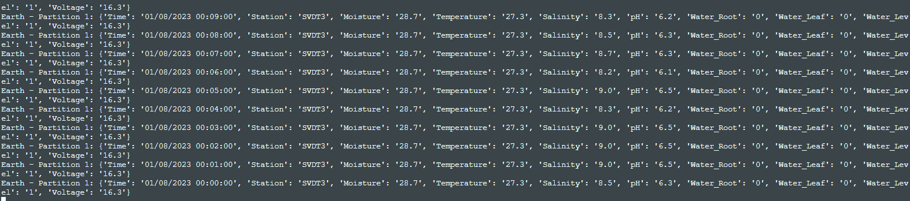

# Instructions to run the lab 1

1. Check if your Docker is running.
2. Navigate to this folder. Run

    `docker-compose up -d`
3. Check if the containers are running `docker ps`

4. Make sure the files `AIR2308.csv`, `WATER2308.csv`, `EARTH2308.csv` are in the same folders.

5. Create the topics

`docker exec -it kafka-lab-kafka-1 kafka-topics --delete --topic Air --bootstrap-server localhost:9092`

`docker exec -it kafka-lab-kafka-1 kafka-topics --delete --topic Earth --bootstrap-server localhost:9092`

`docker exec -it kafka-lab-kafka-1 kafka-topics --delete --topic Water --bootstrap-server localhost:9092`

`docker exec -it kafka-lab-kafka-1 kafka-topics --create --topic Air --partitions 2 --replication-factor 1 --bootstrap-server localhost:9092`

`docker exec -it kafka-lab-kafka-1 kafka-topics --create --topic Earth --partitions 2 --replication-factor 1 --bootstrap-server localhost:9092`

`docker exec -it kafka-lab-kafka-1 kafka-topics --create --topic Water --partitions 2 --replication-factor 1 --bootstrap-server localhost:9092`

6. Run `python producer.py`
7. Run `python consumer.py`

# Logs from producer

# Logs from consumer

